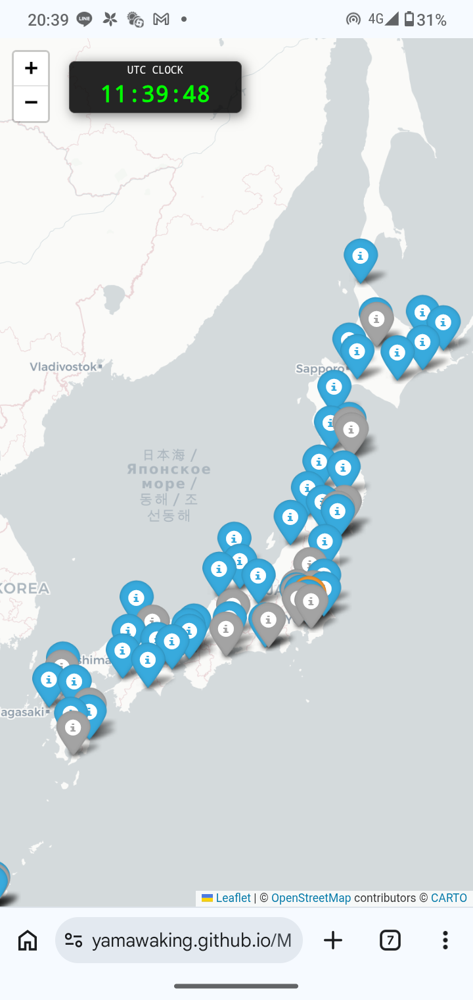
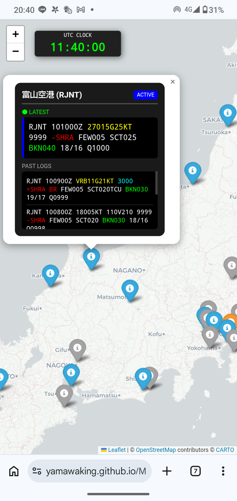

# METARmap_japan
## Overview
  **METARmap_japan** visualizes METAR data from nearly all Japanese airports. Each location is marked on an interactive map. By clicking (on PC) or tapping (on smartphone) the pins, you can view the airport name and its current METAR status. The design and structure are kept simple to ensure an intuitive user experience. No installation is required; simply visit the URL below to get started.
  **url: <https://yamawaking.github.io/METARmap_japan/>**
  
## Structures and Functions
 ・__libraries__: he utilizes folium, requests, re, datetime, timezone, random, ThreadPoolExecutor.

 ・__data sourse__: Real-time METAR data is fetched from *NOAA*. Please note that data may be unavailable if the source is down.
 
 ・The icao codes of all AIRPORTS he handle are below:

*RJCC, RJCK, RJCW, RJCA, RJCO, RJSS, RJSU, RJSB, RJSH, RJSK, RJSC, RJSN, RJAA, RJTJ, RJTA, RJTU, RJTC, RJTI, RJNK, RJNS, RJNA, RJME, RJBB, RJBE, RJOA, RJOT, RJOK, RJFF, RJFT, RJFK, RJFY, ROAH, ROMC*

・__re-run__: This code is set up to re-run *every hour*, so that the latest METAR is always displayed.

## Colorization Rules
 To enhance visibility of critical weather changes, the following rules are applied:

__Wind Speed__: Highlighted in *yellow* when a *GUST* is reported.

__Visibility__: Highlighted in *blue* if horizontal visibility is less than 9999m.

__Present Weather__: Any present weather conditions (e.g., rain, fog) are highlighted in *red*.

__Clouds__: *Ceilings* are highlighted in *green*.

__Location Pins__:

*Blue*: Latest data is available.

*Orange*: Delayed/Stale data.

*Gray*: No data available.

Clock: The on-screen clock indicates UTC (Coordinated Universal Time).

 ## Result

 

